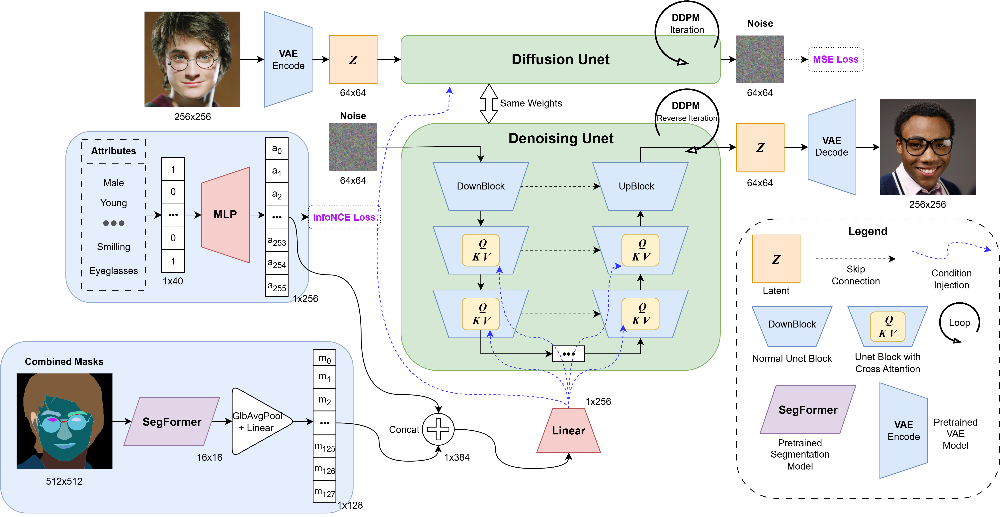

### Hi there 👋

<!--
**Tin-Hoang/Tin-Hoang** is a ✨ _special_ ✨ repository because its `README.md` (this file) appears on your GitHub profile.

Here are some ideas to get you started:

- 🔭 I’m currently working on ...
- 🌱 I’m currently learning ...
- 👯 I’m looking to collaborate on ...
- 🤔 I’m looking for help with ...
- 💬 Ask me about ...
- 📫 How to reach me: ...
- 😄 Pronouns: ...
- ⚡ Fun fact: ...
-->

I'm Tin-Hoang, pursuing MSc at University of Surrey, UK 🇬🇧 | AI researcher at Cinnamon AI, Vietnam 🇻🇳.

# 📃 Publications:
<a id="1">[1]</a>
**Huu Tin Hoang**, Chun-Jen Peng, Hung Tran, Hung Le, Huy Hoang Nguyen.
"LODENet: A Holistic Approach to Offline Handwritten Chinese and Japanese Text Line Recognition, ICPR2020.

# ®️ Patents:
<a id="1">[1]</a> Chun-Jen Peng, **Huu Tin Hoang**, Hung Tran, Huy Hoang Nguyen.
"TEXT LINE RECOGNITION APPARATUS, TEXT LINE RECOGNITION METHOD AND PROGRAM", Japan Patent Office, JP-2022160140-A, Filing Date: 06-04-2021.

# ✨ Certificates:
- AWS Certified Solutions Architect – Professional (SAP-C02), Sep 2023, [badge](http://www.credly.com/badges/2da7142c-2d14-4886-a147-949464a3325c).

  

# ☕ Notable Open-Source Projects:

<table align="center">
  <tr>
    <td align="center">
      
       
      <strong>Federated Learning for Privacy-Preserving Medical AI</strong>
    </td>
  </tr>
</table>

<table align="center">
  <tr>
    <td align="center">
      
       
      <strong>Human Faces Diffusion Generation</strong>
    </td>
    <td align="center">
      
       
      <strong>GHI Time Series Forecasting</strong>
    </td>
    <td align="center">
      
       
      <strong>LODENet ICPR2020 paper</strong>
    </td>
  </tr>
</table>

<table align="center">
  <tr>
    <td align="center">
      
       
      <strong>Vietnamese Image Captioning</strong>
    </td>
    <td align="center">
      
       
      <strong>VN Traffic Signs Detection</strong>
    </td>
  </tr>
</table>

# 📫 How to reach me:
- **Email:** tin.hoang.work@gmail.com
- **Email** (for Cinnamon related): tin@cinnamon.is
- **LinkedIn:** https://www.linkedin.com/in/tin-hoang-ai
- **W&B:** https://wandb.ai/tin-hoang

# 📊 GitHub Metrics:

