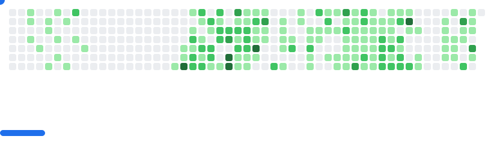

### Hi there 👋

I'm Tin-Hoang | MSc at University of Surrey, UK 🇬🇧 | AI researcher at Cinnamon AI, Vietnam 🇻🇳.

<a href="https://tin-hoang.uk">
  <picture>
    <source media="(prefers-color-scheme: dark)" srcset="images/breakout-dark.svg">
    <source media="(prefers-color-scheme: light)" srcset="images/breakout-light.svg">
    
  </picture>
</a>

[-tin%40cinnamon.is-666699?style=flat-square&logo=gmail&logoColor=white)](mailto:tin@cinnamon.is)

# 📃 Publications:
<a id="1">[1]</a>
**Huu Tin Hoang**, Chun-Jen Peng, Hung Tran, Hung Le, Huy Hoang Nguyen.
"LODENet: A Holistic Approach to Offline Handwritten Chinese and Japanese Text Line Recognition", ICPR2020, Milan, Italy, <a href="https://ieeexplore.ieee.org/document/9412161">[IEEE Xplore]</a>.

<a id="2">[2]</a>
Dhruvraj Singh Rawat, Enggen Sherpa, Rishikesan Kirupanantha, **Tin Hoang**.
"Enhancing Diffusion Face Generation with Contrastive Embeddings and SegFormer Guidance", arXiv preprint 2025, <a href="https://arxiv.org/abs/2508.09847">[arXiv:2508.09847]</a>.

<a id="3">[3]</a>
**Tin Hoang**.
"Efficient Deep Learning for Short-Term Solar Irradiance Time Series Forecasting: A Benchmark Study in Ho Chi Minh City", arXiv preprint 2025, <a href="https://arxiv.org/abs/2512.23898">[arXiv:2512.23898]</a>.

# ®️ Patents:
<a id="1">[1]</a> Chun-Jen Peng, **Huu Tin Hoang**, Hung Tran, Huy Hoang Nguyen.
"TEXT LINE RECOGNITION APPARATUS, TEXT LINE RECOGNITION METHOD AND PROGRAM", Japan Patent Office, JP-2022160140-A, Filing Date: 06-04-2021.

# ✨ Certificates:

*(What good is AI without impacting millions of lives?! Hence, AI x Cloud is my second passion .. gonna catch all SA certs!)*

- AWS Certified Solutions Architect – Professional (SAP-C02), Sep 2023, [badge](http://www.credly.com/badges/2da7142c-2d14-4886-a147-949464a3325c).

  

# ☕ Notable Projects:

<table align="center">
  <tr>
    <td align="center">
      
       
      <strong>Federated Learning for Privacy-Preserving Medical AI</strong>
    </td>
    <td align="center">
      
       
      <strong>Sanskrit-Vi Translation</strong>
    </td>
    <td align="center">
      
       
      <strong>RAG Interactive Profile Chatbot</strong>
    </td>
  </tr>
</table>

<table align="center">
  <tr>
    <td align="center">
      
       
      <strong>Human Faces Diffusion Generation</strong>
    </td>
    <td align="center">
      
       
      <strong>GHI Time Series Forecasting</strong>
    </td>
    <td align="center">
      
       
      <strong>LODENet: Chinese Handwritten OCR</strong>
    </td>
  </tr>
</table>

<table align="center">
  <tr>
    <td align="center">
      
       
      <strong>Vietnamese Image Captioning</strong>
    </td>
    <td align="center">
      
       
      <strong>VN Traffic Signs Detection</strong>
    </td>
  </tr>
</table>

# 📊 GitHub Metrics:

  

